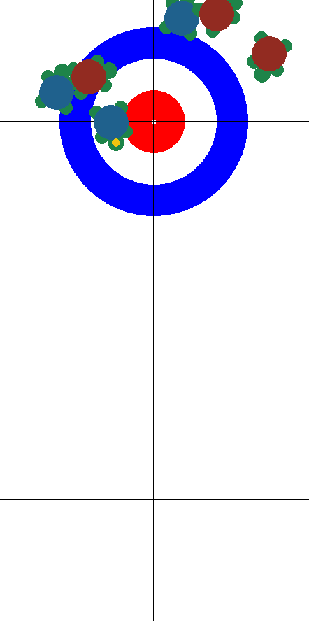

# Curling Turtle

Curling turtle game with a dynamic physics-based simulation using Python and Pygame, where bouncing turtles interact with each other and respond to user input to play curling with turtles.



## Features

- **Ball Physics**: Realistic movement with velocity decay, collision detection, and friction.
- **Turtle Animation**: Each ball (turtle) has animated movement when in motion.
- **User Interaction**: Click and drag to launch a turtle with adjustable speed and direction.
- **Collision Handling**: Walls and other turtles affect movement through impulse-based physics.
- **Color-Coded Teams**: Turtles belong to different teams, influencing their behavior and reactions.

## Requirements

- **Python 3.x**
- **Pygame**: Install it via pip with `pip install pygame`

## How to Run

1. Clone the repository:
   ```bash
   git clone https://github.com/your-repo/Turtle-Ball-Simulation.git
   cd Turtle-Ball-Simulation
   ```

2. Install Pygame if not already installed:
   ```bash
   pip install pygame
   ```

3. Run the simulation:
   ```bash
   python main.py
   ```

## Project Structure

- **`main.py`**: The main script running the simulation.
- **Ball Class**: Represents a bouncing turtle with velocity, rotation, and collision behavior.
- **Manager Class**: Handles all ball interactions, including movement, collisions, and team behavior.
- **Shooter Mechanic**: Allows the user to aim and launch new turtles.
- **Playground Class**: Controls the playing field and game loop.

## Customization

You can modify various parameters in the script:

- **Ball Size** (`BALL_SIZE`)
- **Friction** (`ball.vx *= 0.99`, `ball.vy *= 0.99`)
- **Turtle Animation Speed** (`TURTLE_ANIMATION_FRAMES`)
- **Shooting Force Multiplier** (`dx * 0.05`, `dy * 0.05`)
- **Collision Physics** (`impulse`, `angular_impulse`, `friction`)

## Simulation Details

- **Turtles Move Randomly**: Each turtle has slight unpredictable movement when idle.
- **Collision Impulse**: Velocity is updated based on realistic mass distribution and impulse transfer.
- **Rotational Effects**: Each turtle rotates dynamically upon impact.
- **Team-Based Behavior**: Different teams are represented by color-coded turtles.
- **User Interaction**: The player can launch turtles to interact with others.

## License

This project is licensed under the Mozilla Public License 2.0 (MPL-2.0).

### Additional Note on Commercial Use
**Commercial use of this software or any derived works is prohibited without prior written permission from the original author.** For commercial licensing inquiries, please contact loan.tremoulet.breton@gmail.com.


